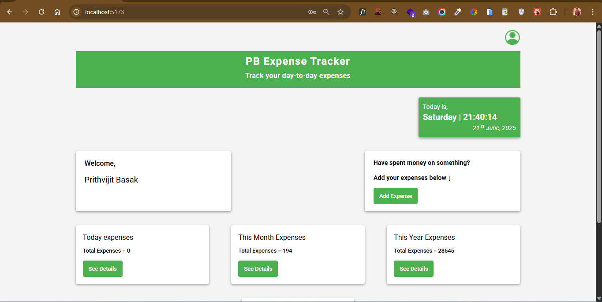

# PB Expense Tracker

Developed a full-stack MERN web application for adding, editing, and deleting day-to-day expenses.



### Purpose

The goal was to keep track of each of my daily expenses.

### Key Features

- **Full-Stack Functionality**  
  Built using the **MERN** stack **(MongoDB, Express.js, React.js, Node.js)**, this project allows users to **add, update, and delete expenses,** with category-wise management and date tracking.
- **Real-Time Data Interaction**  
  Utilizes **RESTful APIs** for dynamic communication between frontend and backend, and **MongoDB** to store user expenses with timestamps for `createdAt` and `updatedAt`.
- **User Authentication**  
  Includes **JWT-based** login and registration system, ensuring that only authenticated users can manage their expense data securely.
- **Responsive Design**  
  Optimized for mobile, tablet, and desktop devices.
- **Error Handling**  
  User-friendly error messages for invalid inputs.

## Installation Guides

Clone and run the project using the below scripts in terminal step by step :-

```
md expense-tracker
```

```
cd expense-tracker
```

```
git clone https://github.com/prithvijitbasak/pb-expense-tracker.git
```

```
cd frontend
```

```
npm run dev
```

*create another terminal*

```
cd backend
```

```
nodemon index.js
```


## Tech stacks used

MongoDB, Express.js, React.js, Node.js, Tailwind CSS
